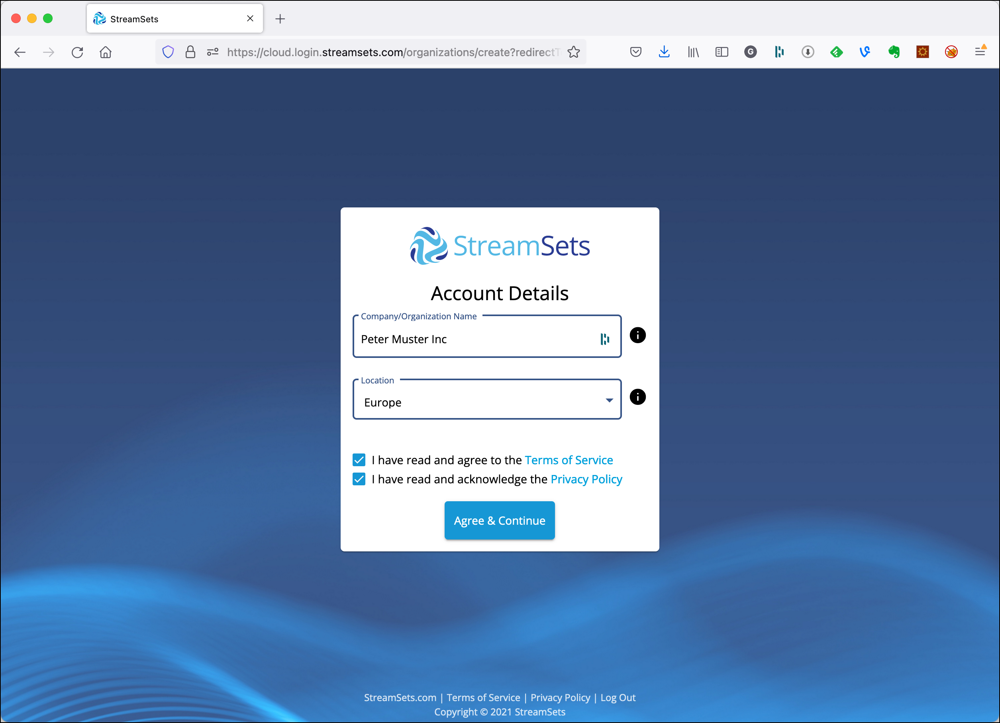
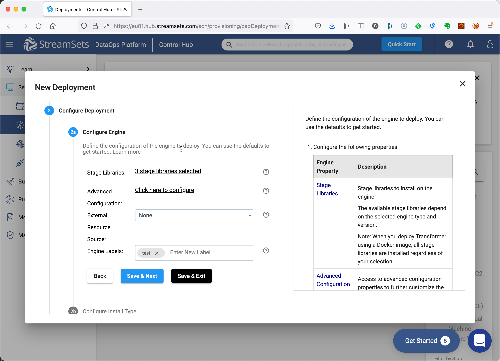
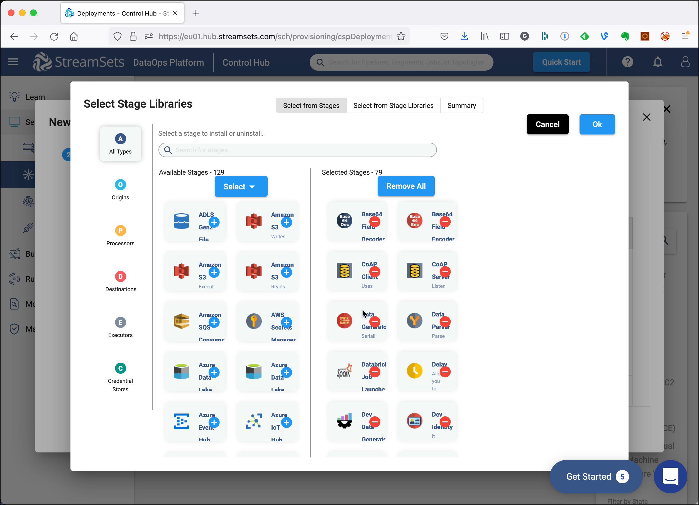
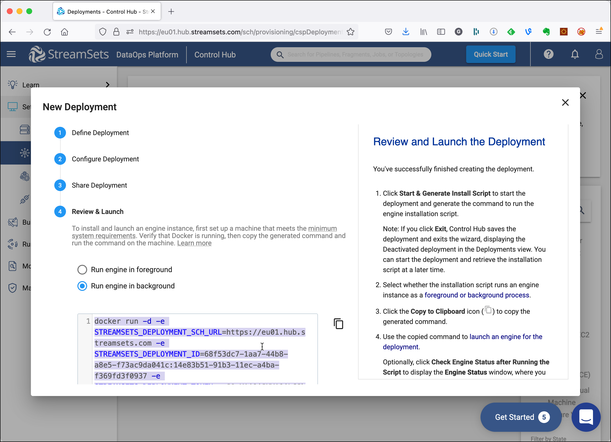

***

## tecnologías: streamsets&#xA;versión: 1.14.0&#xA;validado en: 19.2.2022

# Creación de un entorno de DataOps de StreamSets autogestionado mediante Platys

Esta receta mostrará cómo crear un entorno autogestionado para el [Plataforma DataOps de StreamSets](https://streamsets.com/products/dataops-platform/).

## Regístrese en StreamSets DataPlatform

Desplácese a <https://cloud.login.streamsets.com/signup> y cree una cuenta como se muestra en el diagrama.


Haga clic en **Crear cuenta**. Verifique la cuenta utilizando el enlace en el correo electrónico que debería haber recibido en el mensaje proporcionado.

Ahora inicie sesión en la cuenta recién creada y complete los detalles de la cuenta y haga clic en **De acuerdo y continuar**



y llegará a la página de inicio de StreamSets DataOps


## Crear una implementación de Recopilador de datos de StreamSets

En el navegador de la izquierda, haga clic en **Construir** y navegue hasta el **Entornos** artículo. Debería ver un entorno autoadministrado predeterminado **Entorno autogestionado predeterminado**. Usaremos esto y luego crearemos una implementación.

Desplácese a **Implementaciones** y haga clic en el botón **Crear implementación** en el lienzo principal.


Desplácese hacia abajo y haga clic en **Guardar y siguiente**.

En el siguiente paso, haga clic en el enlace **3 bibliotecas de etapa seleccionadas**



para configurar bibliotecas adicionales que se instalarán. En el lado derecho, se muestran las bibliotecas de etapas instaladas, en el lado izquierdo, se pueden encontrar las bibliotecas de etapas disponibles. Instale una biblioteca haciendo clic en el botón **+** icono.



Una vez que haya terminado, haga clic en **De acuerdo** para volver atrás en la configuración de la implementación.

Ahora haga clic una vez más en **Guardar y siguiente**. Eligió `Docker Image` para el **Tipo de instalación**.


Haga clic en **Guardar y siguiente** y otra vez **Guardar y siguiente** y el **Iniciar y generar script de instalación** y debería ver el script para iniciar el contenedor docker.



Dejando la pantalla abierta, necesitaremos las variables de entorno a la hora de configurar el servicio en `platys`.

    docker run -d -e STREAMSETS_DEPLOYMENT_SCH_URL=https://eu01.hub.streamsets.com -e STREAMSETS_DEPLOYMENT_ID=68f53dc7-1aa7-44b8-a8e5-f73ac9da041c:14e83b51-91b3-11ec-a4ba-f369fd3f0937 -e STREAMSETS_DEPLOYMENT_TOKEN=XXXXXX streamsets/datacollector:4.4.0

El token de implementación ha sido reemplazado, el valor real será mucho mayor.

## Inicializar la plataforma de datos

Ahora vamos a [inicializar una plataforma de datos compatible con platys](../documentation/getting-started.md) con los siguientes servicios habilitados

    platys init --enable-services STREAMSETS_DATAOPS -s trivadis/platys-modern-data-platform -w 1.14.0

O bien añadir el valor de `STREAMSETS_DEPLOYMENT_ID` y `STREAMSETS_DEPLOYMENT_TOKEN` al `config.yml`

          STREAMSETS_DATAOPS_deployment_id: '68f53dc7-1aa7-44b8-a8e5-f73ac9da041c:14e83b51-91b3-11ec-a4ba-f369fd3f0937'
          STREAMSETS_DATAOPS_deployment_token: 'XXXXXX'

o agregue las variables de entorno al entorno, por ejemplo, mediante el comando `.env` archivo

    STREAMSETS_DATAOPS_DEPLOYMENT_ID=68f53dc7-1aa7-44b8-a8e5-f73ac9da041c:14e83b51-91b3-11ec-a4ba-f369fd3f0937
    STREAMSETS_DATAOPS_DEPLOYMENT_TOKEN=XXXXXX

La dirección URL de forma predeterminada se establece en `https://eu01.hub.streamsets.com`. Si necesita otro valor, especifíquelo en el cuadro `config.yml` archivo mediante la propiedad `STREAMSETS_DATAOPS_deployment_sch_url`.

## Comprobar el estado en Streamsets DataOps Platform

En la pantalla de la plataforma DataOps de StreamSets, haga clic en **Comprobar el estado del motor después de ejecutar el script**, si aún no lo has hecho.


Ahora genera y comienza la plataforma

```bash
export DATAPLATFORM_HOME=${PWD}

platys gen

docker-compose up -d
```

En StreamSets DataOps Platform después de un tiempo, debería recibir el siguiente mensaje de confirmación.


El motor que se ejecuta en docker se ha conectado correctamente a la plataforma DataOps de StreamSets. Haga clic en **Cerrar**.

El entorno está listo para ser utilizado.
